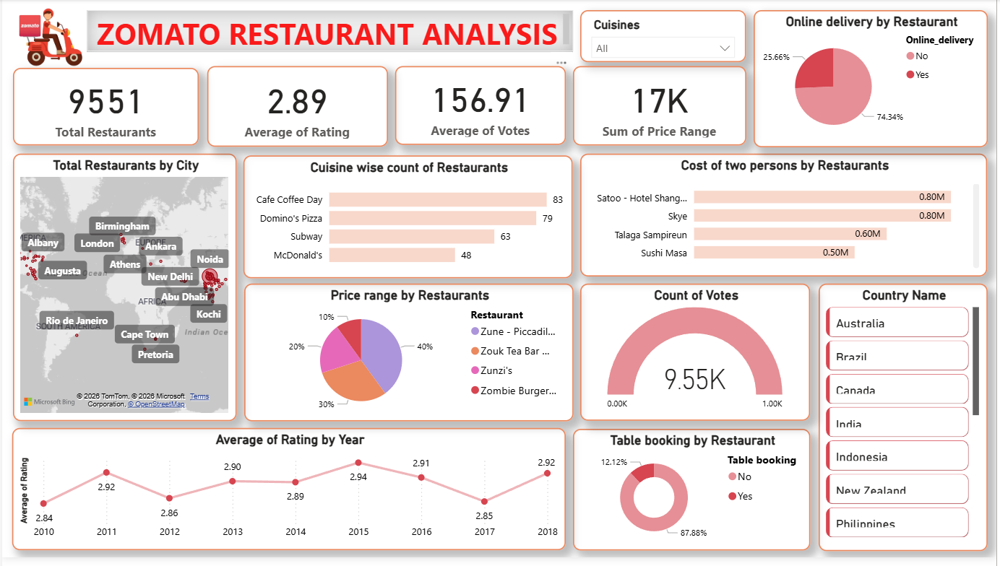

# 🍽️ Zomato Restaurant Analysis Dashboard

An interactive single-page Power BI dashboard built using the Zomato dataset from Kaggle to analyze restaurant ratings, cuisines, pricing, online delivery, table booking, and geographical distribution across different countries and cities.

## 📊 Dashboard Overview

This dashboard provides valuable insights into restaurant trends and customer preferences by visualizing:

* Total number of restaurants
* Average rating and votes
* Price range distribution
* Cuisine-wise restaurant count
* Cost for two persons by restaurant
* Online delivery availability
* Table booking availability
* Country and city-wise restaurant distribution
* Year-wise average ratings

## 🛠️ Tools Used

* **Power BI**
* **Kaggle Zomato Dataset**
* **Power Query**
* **DAX**
* **Data Visualization**

## 📈 Key Metrics

* **Total Restaurants:** 9,551
* **Average Rating:** 2.89
* **Average Votes:** 156.91
* **Total Price Range:** 17K

## 📌 Dashboard Features

* Interactive slicers for cuisines and countries
* Geographical map visualization
* Pie and donut charts for delivery and table booking analysis
* Cuisine-wise restaurant comparison
* Price range analysis
* Year-wise rating trends
* Restaurant cost comparison

## 📷 Dashboard Preview

## 📂 ## Dataset

The dataset used in this project was obtained from Kaggle.

Dataset Link: [Zomato Dataset](https://www.kaggle.com/datasets/shrutimehta/zomato-restaurants-data?select=zomato.csv)

## 🚀 Project Objective

To analyze Zomato restaurant data and provide meaningful insights regarding customer preferences, pricing trends, restaurant availability, and service features using interactive visualizations.

---

⭐ If you found this project useful, consider giving the repository a star!
